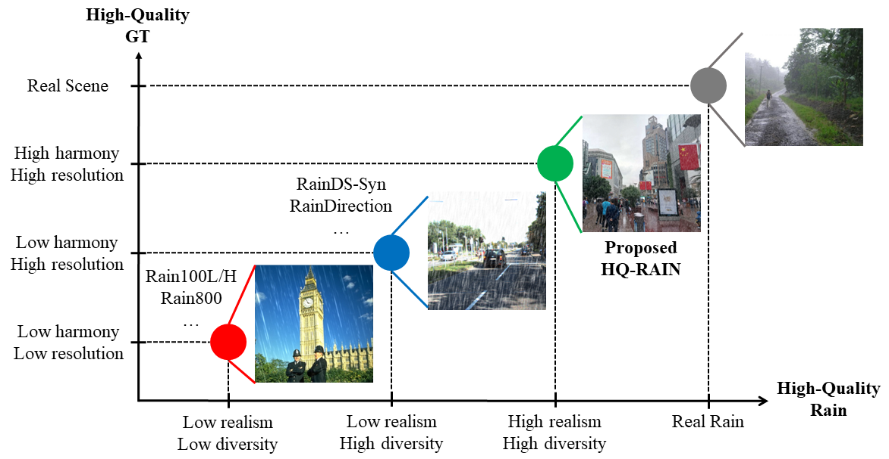

## 📖 Towards Unified Deep Image Deraining: A Survey and A New Benchmark
> [Xiang Chen](https://cschenxiang.github.io/), [Jinshan Pan](https://jspan.github.io/), [Jiangxin Dong](https://scholar.google.com/citations?user=ruebFVEAAAAJ&hl=zh-CN&oi=ao), and [Jinhui Tang](https://scholar.google.com/citations?user=ByBLlEwAAAAJ&hl=zh-CN) <br>
> Nanjing University of Science and Technology

## Project website: [[link]](http://www.deraining.tech/) (Benchmark available now!)

## Abstract
Recent years have witnessed significant advances in image deraining due to the kinds of effective image priors and deep learning models. As each deraining approach has individual settings (e.g., training and test datasets, evaluation criteria), how to fairly evaluate existing approaches comprehensively is not a trivial task. Although existing surveys aim to review of image deraining approaches comprehensively, few of them focus on providing unify evaluation settings to examine the deraining capability and practicality evaluation. In this paper, we provide a comprehensive review of existing image deraining method and provide a unify evaluation setting to evaluate the performance of image deraining methods. We construct a new high-quality benchmark named HQ-RAIN to further conduct extensive evaluation, consisting of 5,000 paired high-resolution synthetic images with higher harmony and realism. We also discuss the existing challenges and highlight several future research opportunities worth exploring. To facilitate the reproduction and tracking of the latest deraining technologies for general users, we build an online platform to provide the off-the-shelf toolkit, involving the large-scale performance evaluation. This online platform and the proposed new benchmark are publicly available and will be regularly updated at http://www.deraining.tech/.

---
<p align="center">
  
</p>

*Our proposed new benchmark narrows the domain gap between real rainy images, due to its properties of high-quality rain with higher realism and diversity, and high-quality GT with higher harmony and resolution.*

---

## Dataset
<table>
<thead>
  <tr>
    <th>Download</th>
    <th>Training Set</th>
    <th>Testing Set</th>
  </tr>
</thead>
<tbody>
  <tr>
    <td>Baidu Cloud</td>
    <td> <a href="https://pan.baidu.com/s/1RYTjR7nT65l1u12X2f83mA?pwd=bxrk">Download </a>[bxrk]  </td>
    <td> <a href="https://pan.baidu.com/s/1h5PhLf6zgnoo9cHZHZ9PHw?pwd=4zqj">Download </a> [4zqj] </td>
  </tr>
</tbody>
<tbody>
  <tr>
    <td>Google Drive</td>
    <td> N/A </td>
    <td> <a href="https://drive.google.com/file/d/1K2BiKHF6FStIX29m72PgZUcYciljG2tq/view?usp=sharing">Download</a> </td>
  </tr>
</tbody>
</table>
Please note that we have not provided the ground turths of the HQ-RAIN testing set. You can submit your derained results for verification through our online website.

## Citation
If you find this project useful in your research, please consider citing:
```
@article{chen2023survey,
    title={Towards Unified Deep Image Deraining: A Survey and A New Benchmark},
    author={Chen, Xiang and Pan, Jinshan and Dong, Jiangxin and Tang, Jinhui},
    journal={arXiv preprint arXiv:2105.15077},
    year={2023}
}
```

## Disclaimer
Please only use the dataset for research purposes.

## Contact
If you have any questions, please feel free to reach me out at chenxiang@njust.edu.cn

